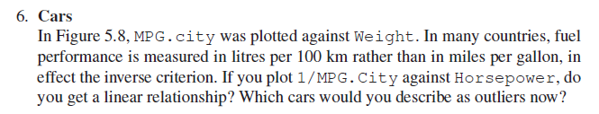

```{r setup, include=FALSE}
knitr::opts_chunk$set(include = TRUE,echo = TRUE, warning=FALSE)
```


## Structure

**1. Examining Continuous Variables**

**2. Looking for Structure: Dependency Relationships and Associations**

**3. Investigating Multivariate Continuous Data**

## 1. Examining Continuous Variables

### Exercise 1. Galaxies


### Solution
#### a) Histogram
Qplot automatically increases the bin size of the histogram, which shows a bimodal distribution with tails that increase on both sides of the histogram.
```{r fig.width=5,fig.height=5,fig.align='center'}
library(MASS)
library(ggplot2)
library(mclust)
data(galaxies)
galaxies <- as.data.frame(galaxies)
names(galaxies) <- 'Velocity'
par(fig=c(0,1,0,1),new=T)
qplot(galaxies$Velocity) +
  labs(title='Histogram of Galaxy Velocity',
       x='Velocity of Galaxy',
       y='Frequency')
```


#### Density estimate
The density plot of the model shows three distinct superclusters with the far right tail not being as distinct.

```{r fig.width=5,fig.height=5,fig.align='center'}
library(mclust)
mod <- mod <- Mclust(galaxies$Velocity)
par(fig=c(0,1,0,1),new=T)
plot(mod,what="density")
```

#### c) Different plots: 
In order to present all the information, I think we need at least 5 different plots to spot all the factors the data set can provide. Boxplot, histogram, rugplot, dotplot, they can all provide different informations.


### Exercise 2. Boston housing


### Solution


#### a) The histograms treats different atributes: 
- CRIM - per capita crime rate by town
- ZN - proportion of residential land zoned for lots over 25,000 sq.ft.
- INDUS - proportion of non-retail business acres per town.
- CHAS - Charles River dummy variable (1 if tract bounds river; 0 otherwise)
- NOX - nitric oxides concentration (parts per 10 million)
- RM - average number of rooms per dwelling
- AGE - proportion of owner-occupied units built prior to 1940
- DIS - weighted distances to five Boston employment centres
- RAD - index of accessibility to radial highways
- TAX - full-value property-tax rate per $10,000
- PTRATIO - pupil-teacher ratio by town
- BLACK - 1000(Bk - 0.63)^2 where Bk is the proportion of blacks by town
- LSTAT - % lower status of the population
- MEDV - Median value of owner-occupied homes in $1000's

There are several different histogram forms, each telling a separate story. Default binwidths, dividing each variable’s range by 30, have been used. Other scalings could reveal more information and would be more interpretable. Is interesting that the vertical scales vary from maxima of 40 to over 400. Plotting histograms individually, choosing binwidths and scale limits
are the main decisions to be taken.

#### b) ZN  and BLACK variable's boxplots might be better they make such an efficient use of the space available.


### Exercise 3. Student survey


### Solution
```{r fig.width=5,fig.height=5,fig.align='center'}
data(survey, package="MASS")
par(fig=c(0,1,0,1),new=T)
hist(survey$Height,
     xlab = 'Height',
     main = 'Histogram of Student`s Height',
     ylab = 'Frequency')
```

```{r fig.width=5,fig.height=5,fig.align='center'}
plot(survey$Height,what="density")
```
b) Examination of national survey data on young adults shows that the separation between the distributions of men's and women's heights is not wide enough to produce bimodality.

### Exercise 4. Movie lengths


### Solution
```{r fig.width=5,fig.height=5,fig.align='center'}
library(ggplot2)
data(movies, package="ggplot2movies")
par(fig=c(0,1,0,1),new=T)
hist(movies$year[movies$length == 90 | movies$length == 7],
     xlab = 'Year',
     main = 'Histogram of Number of movies after 1980',
     ylab = 'Nr.')
```
a) The histogram shows that we have the peaks of 7 minutes or 90 minutes length for both periods: before 1980 and after 1980.

b) In order to classify a movie as short or as long, I think that using denisity estimation is a good ideea. We can set the limit length for a movie to be classified as short. 

### Exercise 5. Zuni educational funding


### Solution

#### a) Histogram or boxplot?
table
```{r fig.width=5,fig.height=5,fig.align='center'}
library(lawstat)
data(zuni, package="lawstat")
par(fig=c(0,1,0,1),new=T)
hist(zuni$Revenue,
     xlab = 'Revenue',
     main = 'Revenue Histogram',
     ylab = 'Nr.')
```
I prefer a histogram for showing 5% the lowest and the highets.

#### b) Density estimation:
```{r fig.width=5,fig.height=5,fig.align='center'}
mod <- mod <- Mclust(zuni$Revenue)
par(fig=c(0,1,0,1),new=T)
plot(mod,what="density")
```

### Exercise 6. Non-detectable


### Solution
There is no "h39b.W1" attribute on CHAIN variable because it has been renamed in "log_virus". For both cases I would use a histogram because I can easily see the number for each case.
```{r fig.width=5,fig.height=5,fig.align='center'}
library(mi)
library(ggplot2)
data(CHAIN)
par(fig=c(0,1,0,1),new=T)
hist(CHAIN$log_virus,
     xlab = 'Case',
     main = 'Histogram of virus cases with 0s',
     ylab = 'Nr.')
```
```{r fig.width=5,fig.height=5,fig.align='center'}
library(mi)
library(ggplot2)
data(CHAIN)
par(fig=c(0,1,0,1),new=T)
hist(CHAIN$log_virus[CHAIN$log_virus != 0],
     xlab = 'Case',
     main = 'Histogram of virus cases without 0s',
     ylab = 'Nr.')
```


### Exercise 7. Diamonds


### Solution
#### a) Diamond Weight
A diamond's weight can be found in "carat" attribute. Let's see how can we see 
```{r fig.width=5,fig.height=5,fig.align='center'}
library(ggplot2)
data(diamonds)
ggplot(diamonds, aes(x=carat, y=price)) + geom_point()
```
I wanted to put in balance the weight of a diamond with it's price. Aparently the most expensive diamonds's weight is between 1,5 and 3 grams. Some of the most cheapest diamonds have weight the least. 

#### b) Distribution of prices
```{r fig.width=5,fig.height=5,fig.align='center'}
data(diamonds, package="ggplot2")
par(fig=c(0,1,0,1),new=T)
hist(diamonds$price,
     xlab = 'Price',
     main = 'Histogram of Diamonds Prices',
     ylab = 'Frequency')
```
For the distribution of Diamond Prices, I chose a histogram. I think it is very easy to understand looking at this histogram that the most expensive diamonds are the fewest. I think a factor that the most expensive diamonds are the fewest is that those diamonds are very rare and very hard to find. Another factor is that it requires more work than the others. 

## 2. Looking for Structure: Dependency Relationships and Associations

### Exercise 1. Movie ratings


Figure 5.7

```{r fig.width=5,fig.height=5,fig.align='center'}
library(ggplot2)
library(dplyr)
data(movies, package = "ggplot2movies")
 ggplot(movies, aes(votes, rating)) + geom_point() + ylim(1, 10)
 
```

(a\) Excluding all films with fewer than 100 votes:
```{r fig.width=5,fig.height=5,fig.align='center'}
library(ggplot2)
library(dplyr)

data(movies, package = "ggplot2movies")

filtered <- filter(movies, votes > 100)
ggplot(filtered, aes(votes, rating)) + geom_point() + ylim(1, 10) 
  
```

(b\) Excluding films with average rating greater than 9 and also the ones that have more than 100000 votes:
```{r fig.width=5,fig.height=5,fig.align='center'}
library(ggplot2)
library(dplyr)

data(movies, package = "ggplot2movies")
#summary(movies)
filtered2 <- filter(movies, rating < 9) #| votes>100000 )


ggplot(filtered2, aes(votes, rating)) + geom_point() + ylim(1, 10) 

```


### Exercise 2. Meta analysis (**Olkin95** dataset)


(a\) Number of observations in each experimental group (n.e) against the corresponding number of observations in each control group (n.c):
```{r fig.width=5,fig.height=5,fig.align='center'}
library(meta)
data(Olkin1995)

ggplot(Olkin1995, aes(n.exp, n.cont)) + geom_point()
# summary(metabin(ev.exp, n.exp, ev.cont, n.cont, data = Olkin1995))
#print(Olkin1995)

```

Observations:
- there is a linear relationship between the variables;
- there are 4 outliers for higher values of the both variables (2500, 6000, 8500);
- there are several gaps in the dataset, between the outliers previously mentioned;
- there seems to be some overplotting at the lower values.

(b\) Restricting the scatterplot to only those with less than 100 patients in each group:
```{r fig.width=5,fig.height=5,fig.align='center'}
library(meta)
data(Olkin1995)
ggplot(Olkin1995, aes(n.exp, n.cont)) + geom_point() + ylim(1, 100) + xlim(1,100)
```
- As there was some overplotting in this range, "zooming" on that interval helps us gain more insight concerning 3-4 outliers, which were not visible before.


### Exercise 3. Zuni


(a\) Scatterplot of average revenue per pupil (Revenue) against the corresponding number of pupils (Mem):
```{r fig.width=5,fig.height=5,fig.align='center'}
library(lawstat)
data(zuni)
#print(zuni)
ggplot(zuni, aes(Revenue,Mem)) + geom_point()

```
Observations: 
- there are two outliers for higher values for the Mem variable;
-there are 4 outliers for values close to 0 for the *Mem* variable and bigger values for the *Revenue*;
- there is a certain interval in which the values are situated and it may be a case of overplotting, as there are 420 rows in the dataset and only a few points on the scatterplot.


(b\) Plotting against **log** of the number of pupils preserves the order of the observations while making outliers less extreme. So the log transform enhances the visualization.

```{r fig.width=5,fig.height=5,fig.align='center'}
library(lawstat)
data(zuni)
ggplot(zuni, aes(Revenue,log(Mem))) + geom_point()
```


Logging also revenue per pupil adds no other insight to the scatterplot, as shown below:

```{r fig.width=5,fig.height=5,fig.align='center'}
library(lawstat)
data(zuni)
ggplot(zuni, aes(log(Revenue),log(Mem))) + geom_point()
```


### Exercise 4. Pearson heights


(a\) Scatterplot of the heights:

```{r fig.width=5,fig.height=5,fig.align='center'}
data(father.son, package="UsingR")
ggplot(father.son, aes(fheight, sheight)) + geom_point()
```

There are some outliers, for both higher and lower values of the variables, but it is hard to determine which ones.

(b\) Including both points and highest density regions:

```{r fig.width=5,fig.height=5,fig.align='center'}
library(hdrcde)
data(father.son, package="UsingR")

par(mar=c(3.1, 4.1, 1.1, 2.1))
with(father.son,hdr.boxplot.2d(fheight, sheight, show.points=TRUE, prob=c(0.01,0.05,0.5,0.75)))

```
After using a density estimate, it's easier to see determine some outliers, outside the contours: 3 for lower values and 2-3 for higher values, all bivariate.


*Note:* **mar**= A numeric vector of length 4, which sets the margin sizes in the following order: bottom, left, top, and right. The default is c(5.1, 4.1, 4.1, 2.1).

(c\) Fitting a linear model to the data and a loess smooth:
```{r fig.width=5,fig.height=5,fig.align='center'}
data(father.son, package="UsingR")

ggplot(father.son, aes(fheight, sheight)) + geom_point() + geom_smooth(method="lm", colour="red") + geom_abline(slope=1, intercept=0)

```

A nonlinear model is not necessary, as the two curves are almost identical:
```{r fig.width=5,fig.height=5,fig.align='center'}
data(father.son, package="UsingR")
ggplot(father.son, aes(fheight, sheight)) + geom_point() +
geom_smooth(method="lm", colour="red", se=FALSE) +
stat_smooth()
```


### Exercise 5. Bank discrimination


A subset of Roberts’ bank sex discrimination dataset from 1979 is available in the package **Sleuth2** under the name *case1202*.

(a\) Scatterplot matrix of the three variables: *Senior*, *Age* and *Exper*:

```{r fig.width=5,fig.height=5,fig.align='center'}
library(GGally)
data(case1202, package="Sleuth2")
#summary(case1202)
par(mar=c(1.1, 1.1, 1.1, 1.1))
#spm(select(case1202, c(4:5,7)), diagonal="histogram", smoother=FALSE, reg.line=FALSE) #groups=bank$Status)
ggpairs(case1202[,c(4:5, 7)], title="Bank discrimination", diag=list(continuous='density'), axisLabels='none')

```


(b\) Scatterplots involving seniority do not have the structure of the scatterplot of experience against age because:


### Exercise 6. Cars



Figure 5.8.
```{r fig.width=5,fig.height=5,fig.align='center'}
data(Cars93, package="MASS")
#print(Cars93)
ggplot(Cars93, aes(Weight, MPG.city)) + geom_point() +
geom_smooth(colour="green") + ylim(0,50)
```
*Note*: fuel economy decreases with weight quite quickly initially and then more slowly.

Plotting 1/MPG.City (litres per 100 km instead of miles per gallon) against Horsepower:
```{r fig.width=5,fig.height=5,fig.align='center'}
data(Cars93, package="MASS")

ggplot(Cars93, aes((1/MPG.city), Horsepower)) + geom_point() + geom_smooth(colour="green") 
```

- Plotting the two variables against each other we get a linear relationship, because the more horsepower it has, the better the gas mileage is. But after a certain value (at about 0.06 litres per 100 km), the cars with less horsepower need more fuel to gain speed.

- The outliers represent the cars that have a lot more horsepower than the others.

```{r fig.width=5,fig.height=5,fig.align='center'}
data(Cars93, package="MASS")
# filtered <- filter(Cars93, Horsepower <200 & MPG.city >20)
filtered <- filter(Cars93, Horsepower > 100)
#print(filtered)
```


### Exercise 7. Leaves


The *leafshape* dataset in the **DAAG** package includes three measurements on each leaf (length, width, petiole) and the logarithms of the three measurements.
  
(a\) Sploms for the two sets of three variables

```{r fig.width=5,fig.height=5,fig.align='center'}
library(GGally)
library(ggplot2)
data(leafshape, package="DAAG")
#summary(leafshape)
print(leafshape)
par(mar=c(1.1, 1.1, 1.1, 1.1))

ggpairs(leafshape[,c(1:3)], title="Standard Leaf measurements", diag=list(continuous='density'), axisLabels='none')

#leafshape$arch <- unlist(leafshape$arch)

ggpairs(leafshape[,c(7:5)], title="Logaritmic Leaf measurements", diag=list(continuous='density'), axisLabels='none')
#, mapping = ggplot2::aes(colour=leafshape[8]), lower = list(continuous = wrap("smooth", alpha = 0.3, size=0.1)))

```

- In the first set of variables there are many points with the same value for the leaf length (*bladelen*) and width (*bladewid*). That's why there is so much overplotting in the first scatterplot.

- For the second set of variables, the log transformation preserves the order of the observations while making outliers less extreme. So the log transform will enhance the visualization.

- I consider the second one more useful as it shows more insight and provides a way to avoid plotting points that represent more than one case.

(b\) Coloring the cases by the variable *arch*, describing the leaf architecture:

```{r fig.width=10,fig.height=10,fig.align='center'}
library(car)
data(leafshape, package="DAAG")
#data(bank, package = "gclus")
par(mar = c(1.1, 1.1, 1.1, 1.1))
 spm( leafshape[c(1:3)],pch = c(16, 16), diagonal = "histogram",smoother = FALSE, reg.line = FALSE,groups = leafshape$arch )
# dplyr::select(leafshape, c(1:3))
```

```{r fig.width=5,fig.height=5,fig.align='center'}
library(car)
data(leafshape, package="DAAG")
#data(bank, package = "gclus")
par(mar = c(1.1, 1.1, 1.1, 1.1))
 spm( leafshape[c(7:5)],pch = c(16, 16), diagonal = "histogram",smoother = FALSE, reg.line = FALSE,groups = leafshape$arch )
# dplyr::select(leafshape, c(1:3))
```

By doing this, we can now observe two clusters formed, based on the arch variable, for each scatterplot in the matrix.


### Exercise 8. Olive oils from Italy


(a\) Scatterplot matrix of the eight continuous variables representing fatty acids:

```{r fig.width=10,fig.align='center'}
library(GGally)
library(ggplot2)
data(olive, package="zenplots")
#summary(olive)

ggpairs(olive[,c(3:10)], title="Olive acids", diag=list(continuous='density'), axisLabels='none')
#pairs(olive)
```

- The acids that are strongly positively associated are *palmitic* and *palmitoleic*.
- The acids that are strongly negatively associated are *palmitic* and *oleic* or *palmitoleic* and *oleic*.

(b\) 
There might be some outliers depending on different variables:

- *stearic*, we have outliers for higher values on the x-axis when plotting against all other variables;
- there is one outlier in every plot of *palmitic* against all of the other variables (column one of the matrix), usually with a lower value on the x-axis (excepting the one in the plot against the oleic variable, where they are negatively associated);
- there is one outlier in every plot of *oleic* against all of the other variables (column four of the matrix), usually with a higher value on the x-axis (excepting the first three variables);
- there are 2-3 outliers for every plot of *linolenic* variable against the others, for high values.

Other obsevations:

- For the plots against the *eicosenoic* variable we can see that the value that appears most often in the set of data (value called *mode*) is 0, because most values have the Y coordinate equal to 0. 
- For the *linolenic* variable we can observe some gap intervals in the distribution of Y, especially for lower values;


### Exercise 9. Boston housing 

<center>

</center>

(a\) Splom of all continous variables, excepting *chas*:

```{r fig.width=16,fig.height=10,fig.align='center'}
library(GGally)
library(ggplot2)
data(Boston, package="MASS")
#print(Boston)
ggpairs(Boston[,-c(4)], title="Boston housing", diag=list(continuous='density'), axisLabels='none')

```
Variables that are positively associated with *medv* are: **rm**.

(b\) Several scatterplots involving the variable *crim* have an unusual form, because some of the other variables have constant values in most cases. 
    For example the *ptratio* has values only in a determined range.

(c\)


## 3. Investigating Multivariate Continuous Data

### Exercise 1. Swiss


### Solution

```{r fig.width=10,fig.height=5}
library('GGally')

# (a)
ggparcoord(data = swiss, columns=c(1:6), scale="uniminmax", alphaLines=0.2) + 
  xlab("") + ylab("")
```

(b\) There might be some outliers depending on different variables:

- Fertility, we have 1 or maybe 3 observations which could act as outliers in the lower range;
- Education, there is clearly 1 outlier which has a much higher value than expected
- Catholic, there are 3 observations in the middle (we could call them outliers too) whose values are not among the most popular ones (the lowest or the highest values)
- Infant.Mortality, one possible outlier at the lowest value
- Among many variables (Fertility, Agriculture, Examination, Education, Catholic) we can see there is one observation which has either the highest or the lowest values for each variable (except for Catholic, where the value is in the middle)

(c\) It looks like the variable Catholic has 2 modes, one at the lowest range (0 - 0.25) and one at the highest ends (0.8 - 1.0). So it is the case in Switzerland that usually a province will either have a majority of catholic or of non-catholic people.

```{r fig.width=10,fig.height=5}
# (d)
swiss1 <- within(swiss, 
                 catholics_level <- factor(ifelse(Catholic > 80, 'High', 'Low')))

ggparcoord(data = swiss1[order(swiss1$Catholic),], columns=c(1:6), scale="uniminmax", 
           groupColumn="catholics_level", alphaLines=0.5) + 
  xlab("") + ylab("") + 
  theme(legend.position = "none")
```
 
(d\) The provinces with high level of Catholic look like they have a higher index of Fertility, a lower level of Examination (i.e. % draftees receiving highest mark on army examination) and Education. The Infant.Mortality variable looks like it is not affected that much by whether the province has a majority of catholic or non-catholic people.
 


### Exercise 2. Pottery


 
### Solution

```{r fig.width=10,fig.height=5}
# (a)
library('HSAUR2');
ggparcoord(data = pottery, columns=c(1:9), scale="uniminmax", alphaLines=0.2) + 
  xlab("") + ylab("")
```
 
 (a\) In this pcp we could see different details:
 
 - There are some negative correlations between different variables: Al2O3 - Fe2O3, MgO - CaO, K2O - TiO2, as suggested by the intersections of the polygonal lines
 - There appears to be a distinct group of pottery which has low values of Fe2O3, MgO, CaO, Na2O, MnO and higher values of Al2O3 and TiO2
 - There are different outliers for Fe2O3, MgO, CaO, Na2O, TiO2 individually, which have much higher values than the usual ones
 - For BaO variable the values seem to be uniformly distributed
 
 
```{r fig.width=10,fig.height=5}
# (b)
# print MgO column as sorted, and select the right threshold (which is 1.0)
sort(pottery$MgO)

pottery1 <- within(pottery, 
                   mgo_level <- factor(ifelse(MgO < 1, 'Low', 'High')))  # use the 1.0 threshold here

ggparcoord(data = pottery1[order(pottery1$MgO),], columns=c(1:9), scale="uniminmax", 
           groupColumn="mgo_level", alphaLines=0.5) + 
  xlab("") + ylab("") + 
  theme(legend.position = "none")
```

(b\) On the other variables, the cases with low MgO also have lower Fe2O3, CaO, Na2O, K2O, MnO than the other cases. Also, some of these cases have higher values for Al2O3 and TiO2.

```{r fig.width=10,fig.height=5}
# (c)
ggparcoord(data = pottery, columns=c(1:9), scale="uniminmax", 
           groupColumn="kiln", alphaLines=0.5) + 
  xlab("") + ylab("") + geom_line(size=0.7)
```

(c\) In this pcp we can see some differences between different kilns as follows:

- The kilns 4 and 5 can be easily distinguished by the other kilns by looking at the lower values of the Fe2O3, MgO, CaO, Na2O, K2O, MnO variables.
- The kiln 1 has much higher values of CaO than the other types of kiln.
- The kilns 2 and 3 have the highest values of MgO, K2O and MnO.
- The kiln 1 has higher values of MgO than kilns 4 & 5 but lower than kilns 2 & 3.


### Exercise 3. Olive oils


### Solution

```{r fig.width=10,fig.height=5}
# (a)
library('pdfCluster')
data("oliveoil")
ggparcoord(data = oliveoil, columns=c(3:10), scale="uniminmax", alphaLines=0.2) + 
  xlab("") + ylab("")
```

(a\) Some of the observed features in this pcp:

- There are different outliers for the _oleic_ & _linolenic_ variables with higher values, and one more outlier for _palmitic_ variable having the lowest value
- There is a clear negative correlation between _oleic_ and _linoleic_ variables (suggested by the intersection of the lines), and also a not-so-strong negative correlation between _palmitoleic_ and _stearic_
- There is a clear positive correlation between _palmitic_ and _palmitoleic_ variables (since most of the lines uniting these 2 axis are almost parallel)
- It looks like for the _linolenic_ variable there are 2 distinct groups of oils in the lowest range (much data concentrated inside the values 0.0, respectively ~0.13, on uniminmax scale) and one more larger group (ranging from 0.25 to 0.75 values)
- There is a group of oils which owns its _eicosenoic_ values in the lowest range, while the other groups are ranging from 0.13 to 0.75

```{r fig.width=10,fig.height=5}
# (b)
ggparcoord(data = oliveoil, columns=c(3:10), scale="uniminmax", 
           groupColumn="region", alphaLines=0.7) + 
  xlab("") + ylab("") 
```

(b\) In this pcp we can find that:

- There are actually many oil types (by region) which have a low _eicosenoic_ value (so not only one type as I previously supposed at (a\))
- The Apulia.south and Sicily regions have the oils with the highest _palmitic_ and _palmitoleic_ values, and with the lowest _oleic_ values
- Maybe in this dataset the most oils are from Apulia.south since there are way too many observations compared to other regions
- Sardinia.inland (pale green) and Sardinia.coast (light blue) tend to have the same values across all the variables (as expected, since those oils come from same bigger region - Sardinia)

(c\) For the scatterplot matrix down below:

- we can easily see the correlations between other variables as well
- we can immediately check the density distribution of each variable individually
- it is a little more difficult to spot the outliers on all the variables at once
- it cannot take into account other feature analysis like the oil's region

While for a pcp:

- it is helpful for cluster analysis, where we used to bring out the oils by their regions
- it is easier to spot the outliers just by looking at the profiles which are further away than all the other profiles
- we can observe only the correlations between any 2 adjacent axis (variables), instead of spotting all the possible pairs how it would have been done in a scatterplot. So this way we might miss relevant information regarding possible strongly correlated variables
- it is harder to estimate the distribution of a variable just by looking at its points along the vertical axis

```{r fig.width=10,fig.align='center'}
ggpairs(oliveoil[,c(3:10)], title="Olive acids", diag=list(continuous='density'), axisLabels='none')
```


### Exercise 4. Cars


### Solution

```{r fig.width=10,fig.height=5}
data(Cars93, package="MASS")
col_indices = which(names(Cars93)%in%c('Price', 'MPG.city', 'MPG.highway', 'Horsepower', 'RPM', 'Length', 'Width', 'Turn.circle', 'Weight'))
ggparcoord(data = Cars93, columns=col_indices, scale="uniminmax", alphaLines=0.7) + 
  xlab("") + ylab("") 
```

(a\) In this plot we could conclude the following:

- There are a few outliers regarding the Price, MPG.city, MPG.highway and Width variables
- For the Width and Turn.circle variables there are many concentrated observations in some values, as if these variables would have been acting more like some categorical variables
- The weight variables looks like having an uniform distribution over its values
- There is a clear positive correlation between the Length and the Width (since most of the lines uniting these axes are somewhat parallel)
- There is a clear positive correlation between MPG.city and MPG.highway (same reason as above)

(b\) I would plot a pcp (down below), and here we could observe some differences between USA and non-USA cars:

- USA cars tend to have lower RPM and higher Length & Horsepower
- The outliers identified for MPG.city and MPG.highway variables are coming from USA car observations
- Regarding the price, we can't tell for sure whether the USA cars are more expensive than the non-USA ones, since there is a big variety of prices among both categories

```{r fig.width=10,fig.height=5}
# (b)
ggparcoord(data = Cars93, columns=col_indices, scale="uniminmax", 
           groupColumn="Origin", alphaLines=0.7) + 
  xlab("") + ylab("")
```

(c\) Yes, a pcp with _uniminmax_ scaling is informative, since we got to extract some insights from it in (a\) and (b\). Down below we can find the same pcp but with a standard scale applied (subtracting the mean and dividing by the standard deviation, for each axis) and having its observations categorized by the number of Cylinders. Here we can also see that:

- the Price, MPG.city, MPG.highway variables have the highest variance (or standard deviation) since the data is more spread than the other variables
- the most "compact" variables (with the smallest variance) are RPM, Turn.circle and Weight
- the cars having 4 cylinders are expected to have the mean values for most of the variables
- the outliers usually come from cars having 3, 6 or 8 cylinders
- it looks like the price can be correlated with the number of cylinders (the more cylinders, the higher the price), since blue lines are at top (8 cylinders) while red lines are at bottom (3 cylinders) for the Price axis
- it looks like the number of cylinders can also be positively correlated with Horsepower, Length, Width, Turn.circle and Weight

```{r fig.width=10,fig.height=5}
# (c)
ggparcoord(data = Cars93, columns=col_indices,
           groupColumn="Cylinders", alphaLines=0.7) + 
  xlab("") + ylab("") + geom_line(size=0.75)
```


### Exercise 5. Bodyfat


### Solution

```{r fig.width=10,fig.height=5}
data(bodyfat, package="MMST")
ggparcoord(data = bodyfat, columns=1:15, scale="uniminmax", alphaLines=0.7) + 
  xlab("") + ylab("") 
```

(a\) There is clearly one outlier which has the maximum value 1.0 on the uniminmax scale in this pcp for many variables (bodyfat, weight, neck, chest, abdomen, hip, thigh, knee, biceps, wrist). Not being the tallest man from the sample (looking at its height), I would say this outlier is not an athlete, but maybe a person with serious obesity problems.

Particularly, there are 2 more outliers on the _ankle_ axis, who might also be outliers on the _hip_, _abdomen_ and _chest_ measurements.

(b\) The height variable looks like it has many points of concentration, like it would be a categorical variable. Maybe the reason why this is happening is that the height was measured only in one decimal instead of using a higher precision. We can quickly check this down below:
```{r}
# by looking at some of the observations, actually it looks like the data contains estimations to the closest quarter float (0.00/0.25/0.50/0.75).
bodyfat$height[1:10]
```

So the reason for this "categorical behaviour" is indeed the low precision of the floating numbers.

(c\) As seen in the pcp, as the _density_ increases, the _bodyfat_ decreases, and vice-versa. So there is clearly a negative correlation between those 2 variables. This is also suggested by the intersection of all profiles in (what appears to be) a single point.

(d\) Yes, the ordering of the variables can affect the pcp display. I think in this specific dataset we can try ordering the variables after their medians, so we can see all the measurement categories from highest to lowest to make a better idea about our data.

```{r fig.width=7,fig.height=5}
medians = apply(bodyfat[, 1:15], 2, median, na.rm=TRUE)
ordered_medians_indexes = order(medians)
ggparcoord(data = bodyfat, alphaLines=0.3,
           scale="globalminmax", order=ordered_medians_indexes) + coord_flip()
```

Here we can see for example that the wrist has the smallest measurement out of all the body measurements and that the chest is the largest part of a man's body.


### Exercise 6. Exam marks


### Solution

(a\) I think a good pcp to present to others would be the following, with _globalminmax_ scale and y limits 0-100, where we can deduce that:

- Algebra has the highest minimum mark. However, excluding the one outlier in the _vectors_ exam, the Vectors exam would have the highest minimum mark, with about 25 points. Also, it looks like _Vectors_ has the maximum mark out of all the exams, which would suggest that the Vectors subject is the easiest one to learn out of all the 5, which I personally agree.
- Most of the profiles tend to appear somehow horizontal while connecting most of the variables, which would suggest that well prepared students perform well on all the subjects, while "bad" students will keep their same low performance among all the subjects. But of course there are cases where a student performs very well on a subject and poorly on another one.
- There are some positive correlations between _mechanics_ and _vectors_, _vectors_ and _algebra_, _analysis_ and _statistics_, which should stand since it is known that all of these subjects are related.

```{r fig.width=10,fig.height=5}
library('SMPracticals')
ggparcoord(data = mathmarks, columns=1:5, scale="globalminmax", alphaLines=0.7) + 
  xlab("") + ylab("") + coord_cartesian(ylim=c(0,100))
```

We could try to plot a pcp by highlighting the students who scored better on the Vectors exam. In this pcp we can observe that:

- the students who performed better in Vectors, also did great at Mechanics and Algebra exams; and most of them succeeded to take the greatest marks at Analysis and Statistics too
- as mentioned before, there might be cases where good students at some subjects (Vectors) may perform worse at other subjects (Analysis)
- three students who know well Vectors performed the best at Statistics (unusual mention but just as a fun fact)

```{r fig.width=10,fig.height=5}
mathmarks1 <- within(mathmarks, 
                     vectors_perf <- factor(ifelse(vectors > 60, 'Good', 'Bad')))
ggparcoord(data = mathmarks1, columns=1:5, alphaLines=0.7, scale="globalminmax", 
           groupColumn='vectors_perf') + 
  xlab("") + ylab("") + theme(legend.position = "none") + coord_cartesian(ylim=c(0,100))
```

```{r fig.width=10,fig.height=5}
# (b)
ggparcoord(data = mathmarks, columns=1:5, scale="globalminmax", alphaLines=0.1, boxplot=TRUE) + 
  xlab("") + ylab("") + coord_cartesian(ylim=c(0,100))
```

(b\) By using the boxplots, we can see easier the maximum, minimum, median values and the outliers for each exam. By looking at this plot, we can't tell for sure that the Mechanics and Vectors were closed-book exams. We can say for sure that the Statistics exam (an open-book exam) has the lowest median mark out of all the subjects which would contradict somehow the idea of it being an open-book exam.

However, by looking at the minimum value (~3 points) of the Mechanics exam, we can say it is the lowest among all subjects, which confirms the fact it has been a closed-book exam.

Regarding the polygonal lines, I think it is not mandatory to draw then in a boxplot pcp in this specific scenario, even by using the alphaLines option, since it just fills the space without any useful additional information, as it can be seen above.


### Exercise 7. Wine


### Solution

(a\) By using the following pcp's, which separate the profiles by the wine class (red - Barbera, green - Barolo, blue - Grignolino), we can easily distinguish which variables help us by classifying different wines:

- lower values of OD, Hue and Flav are associated to Barbera wines
- higher values of Color, NonFlavPhenols, MalicAcid are associated to Barbera wines
- lower values of AlcAsh are associated to the Barolo wines
- higher values of Proline, OD and Flav are associated to the Barolo wines
- lower values of Color, Mg, MalicAcid and Alcohol are associated to Grignolino wines
- higher values of Hue are associated to Grignolino wines


```{r fig.width=10,fig.height=8}
library('gridExtra')
data(wine, package="MMST")
a = ggparcoord(wine, columns=1:13, groupColumn="class",scale="uniminmax") + xlab("") + ylab("") +
  theme(legend.position = "none") +
  scale_colour_manual(values = c("red","grey", "grey")) + coord_flip()
b = ggparcoord(wine, columns=1:13, groupColumn="class",scale="uniminmax") + xlab("") + ylab("") +
  theme(legend.position = "none") +
  scale_colour_manual(values = c("grey","green", "grey")) + coord_flip()
c = ggparcoord(wine, columns=1:13, groupColumn="class",scale="uniminmax") + xlab("") + ylab("") +
  theme(legend.position = "none") +
  scale_colour_manual(values = c("grey","grey", "blue")) + coord_flip()
grid.arrange(a, b, c, nrow=1)
```

(b\) There are for sure enough outliers in the data, just by looking for example at the extreme high/low values from the blue pcp at the MalicAcid, Ash, Flav, Hue variables.

(c\) Yes, there might be some evidence that these classes have subgroups of wines inside them. Some examples would be:

- in the red pcp, the Color presents two (or even three) ranges (subgroups) of Barbera wines
- in the green pcp, the OD and Proa variables can distinguish 3 subgroups of Barolo wines
- in the blue pcp is the biggest variance, since many variables present wide ranges of values, like: Proa, NonFlavPhenols, Phenols and Ash, so there might be multiple subgroups of Grignolino wines too.


### Exercise 8. Boston housing


### Solution


```{r fig.width=14,fig.height=7}
data(Boston, package="MASS")

hcluster = hclust(dist(Boston), method='ward.D2')
clu4 = cutree(hcluster, k=4)
clus = factor(clu4)
boston1 = cbind(Boston, clus)

# (a)
ggparcoord(boston1, columns=1:14, groupColumn="clus", scale="uniminmax") + 
  xlab("") + ylab("")
  

# (b)
a = ggparcoord(boston1[which(boston1$clus == 1),], columns=1:14, scale="uniminmax",
               mapping=aes(color='#f5aca7')) + 
  xlab("") + ylab("") +
  theme(legend.position = "none") +
  scale_colour_manual(values = c("#f5aca7"))
b = ggparcoord(boston1[which(boston1$clus == 2),], columns=1:14, scale="uniminmax",
               mapping=aes(color='#a8c75a')) + 
  xlab("") + ylab("") +
  theme(legend.position = "none") +
  scale_colour_manual(values = c("#a8c75a"))
c = ggparcoord(boston1[which(boston1$clus == 3),], columns=1:14, scale="uniminmax",
               mapping=aes(color='#1ec5c9')) + 
  xlab("") + ylab("") +
  theme(legend.position = "none") +
  scale_colour_manual(values = c("#1ec5c9"))
d = ggparcoord(boston1[which(boston1$clus == 4),], columns=1:14, scale="uniminmax", 
               mapping=aes(color='#cc8afd')) + 
  xlab("") + ylab("") +
  theme(legend.position = "none") +
  scale_colour_manual(values = c("#cc8afd"))
grid.arrange(a, b, c, d)

# (c)
a = ggparcoord(rbind(boston1[which(boston1$clus != 1),], boston1[which(boston1$clus == 1),]),
               columns=1:14, groupColumn="clus", scale="uniminmax") +
  xlab("") + ylab("") +
  theme(legend.position = "none") +
  scale_colour_manual(values = c("#f5aca7","grey", "grey", "grey"))
b = ggparcoord(rbind(boston1[which(boston1$clus != 2),], boston1[which(boston1$clus == 2),]),
               columns=1:14, groupColumn="clus", scale="uniminmax") +
  xlab("") + ylab("") +
  theme(legend.position = "none") +
  scale_colour_manual(values = c("grey","#a8c75a", "grey", "grey"))
c = ggparcoord(rbind(boston1[which(boston1$clus != 3),], boston1[which(boston1$clus == 3),]),
               columns=1:14, groupColumn="clus", scale="uniminmax") +
  xlab("") + ylab("") +
  theme(legend.position = "none") +
  scale_colour_manual(values = c("grey","grey", "#1ec5c9", "grey"))
d = ggparcoord(rbind(boston1[which(boston1$clus != 4),], boston1[which(boston1$clus == 4),]),
               columns=1:14, groupColumn="clus", scale="uniminmax") +
  xlab("") + ylab("") +
  theme(legend.position = "none") +
  scale_colour_manual(values = c("grey","grey", "grey", "#cc8afd"))
grid.arrange(a, b, c, d)

```

The first plot could be useful when not enough space is available, however, when 4 clusters must be displayed, it becomes quickly really hard to distinguish the different categories, the plot becoming a messy mix of colors.

The second way, where we plot each cluster individually, looks much cleaner than the other ones. However, we can observe that the shapes are not the same as in the other two plots. That's because plotting them individually will cause the minimum and maximum values on each axis to change, restricting them to the cluster domain only. So this way, a _uniminmax_ scale would not be so helpful to make comparisons between clusters, but maybe a _globalminmax_ would be more appropriate for that kind of task.

The third option, which consists of plotting each cluster individually and the other ones in the background, looks like a clean way of visualizing the groups and at the same time comparing their differences. It preserves the axis limits and we can spot much easier the outliers. If I had to choose, this would be the way I would display my clustering results.
